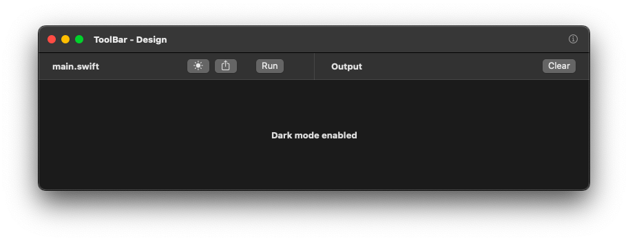

# Custom Toolbar MacOS Demo App

## Overview
This macOS SwiftUI app demonstrates how to create a **custom toolbar** with properly aligned buttons, a centered divider, and a smooth UI experience. The toolbar includes:

- A **file title**.
- A **dark mode toggle** with real-time theme switching.
- A **share button**.
- A **run button** with a progress indicator.
- A **divider centered on the screen**.
- A **clear button** on the far right.
- **Tooltips** for each button when hovered, like in Xcode.

## Preview


## Initial Implementation (Single-File Approach)
Initially, the toolbar was implemented inside `ContentView.swift` without separation of concerns, It is designed to appear beside the window control buttons, similar to Xcode’s toolbar:

```swift
struct ContentView: View {
    @State private var isDarkMode = false
    @State private var isFormatting = false
    @State private var lastAction = "No action yet"

    var body: some View {
        VStack {
            Text("Last Action: \(lastAction)")
                .font(.headline)
                .padding()
                .frame(maxWidth: .infinity, alignment: .center)
        }
        .frame(minWidth: 800, minHeight: 200)
        .toolbar {
            ToolbarItemGroup(placement: .automatic) {
                Text("main.swift")
                    .font(.headline)
                
                Button(action: {
                    isDarkMode.toggle()
                    lastAction = isDarkMode ? "Dark mode enabled" : "Light mode enabled"
                }) {
                    Image(systemName: isDarkMode ? "sun.max.fill" : "moon.fill")
                }
                .help("Toggle Dark Mode")
                
                Button(action: { lastAction = "Share clicked" }) {
                    Image(systemName: "square.and.arrow.up")
                }
                .help("Share")
                
                Button(action: {
                    isFormatting = true
                    lastAction = "Run clicked"
                    DispatchQueue.main.asyncAfter(deadline: .now() + 2.0) {
                        isFormatting = false
                        lastAction = "Formatting Complete"
                    }
                }) {
                    Text("Run")
                }
                .disabled(isFormatting)
                
                if isFormatting {
                    ProgressView()
                        .progressViewStyle(CircularProgressViewStyle())
                        .frame(width: 16, height: 16)
                        .scaleEffect(0.5)
                }
                
                Divider()
                
                Button(action: { lastAction = "" }) {
                    Text("Clear")
                }
                .help("Clear Output")
            }
        }
    }
}
```

## Refactored Approach (Separation of Concerns)
To follow better coding practices, we modularized the components:

### `ContentView.swift`
```swift
struct ContentView: View {
    @State private var isDarkMode = false
    @State private var lastAction = "No action yet"
    @State private var isFormatting = false

    var body: some View {
        VStack(spacing: 0) {
            // 🔥 Custom Toolbar Positioned Manually
            CustomToolbar(isDarkMode: $isDarkMode, isFormatting: $isFormatting, lastAction: $lastAction)
                .frame(maxWidth: .infinity, maxHeight: 40)
                .padding(.horizontal, 10)
                .background(Color(NSColor.windowBackgroundColor))
                .overlay(Divider(), alignment: .bottom)

            VStack {
                Text("\(lastAction)")
                    .font(.headline)
                    .frame(alignment: .center)
            }
            .frame(maxWidth: .infinity, maxHeight: .infinity)
            
        }
        .frame(minWidth: 800, minHeight: 200)
        .toolbar {
           ToolbarItemGroup(placement: .automatic) {
               Button {
                   NSApp.orderFrontStandardAboutPanel()
               } label: {
                   Image(systemName: "info.circle")
               }
               .help("info")
               .disabled(isFormatting)
           }
       }
    }
}
```

### `CustomToolbar.swift`
```swift
struct CustomToolbar: View {
    @Binding var isDarkMode: Bool
    @Binding var isFormatting: Bool
    @Binding var lastAction: String
    @Environment(\.colorScheme) private var colorScheme

    var body: some View {
        HStack(spacing: 12) {
            HStack {
                Text("main.swift")
                    .font(.headline)
                Spacer()
                ToolbarButton(icon: isDarkMode ? "sun.max.fill" : "moon.fill") {
                    isDarkMode.toggle()
                    lastAction = isDarkMode ? "Dark mode enabled" : "Light mode enabled"
                }.help("Toggle Dark Mode")

                ToolbarButton(icon: "square.and.arrow.up") {
                    lastAction = "Share clicked"
                }.help("Share")

                RunButton(isFormatting: $isFormatting, lastAction: $lastAction)
            }
            
            Spacer(minLength: 0)
            Divider()
            Spacer(minLength: 0)
            
            HStack(spacing: 12) {
                Text("Output")
                    .font(.headline)
                Spacer()
                ToolbarButton(text: "Clear") {
                    lastAction = ""
                }
            }
        }
        .frame(maxWidth: .infinity)
        .padding(.horizontal, 10)
        .preferredColorScheme(isDarkMode ? .dark : .light)
    }
}

```

### `ToolbarButton.swift`
```swift
struct ToolbarButton: View {
    var icon: String?
    var text: String?
    var tooltip: String
    var action: () -> Void
    
    var body: some View {
        Button(action: action) {
            if let icon = icon {
                Image(systemName: icon)
            } else if let text = text {
                Text(text)
            }
        }
        .help(tooltip)
    }
}
```

### `RunButton.swift`
```swift
struct RunButton: View {
    @Binding var isFormatting: Bool
    @Binding var lastAction: String
    
    var body: some View {
        HStack {
            Button(action: {
                isFormatting = true
                lastAction = "Run clicked"
                DispatchQueue.main.asyncAfter(deadline: .now() + 2.0) {
                    isFormatting = false
                    lastAction = "Formatting Complete"
                }
            }) {
                Text("Run")
            }
            .disabled(isFormatting)
            
            if isFormatting {
                ProgressView()
                    .progressViewStyle(CircularProgressViewStyle())
                    .frame(width: 16, height: 16)
                    .scaleEffect(0.5)
            }
        }
    }
}
```

## Features
- **Better Code Structure**: Separated components for reusability.
- **Centered Divider**: Ensures proper alignment.
- **Hover Tooltips**: Like Xcode.
- **Smooth Dark Mode Toggle**.
- **Run Button Animation**: Shows progress while running.

This refactored version follows the **Separation of Concerns** principle while achieving the same functionality as the initial implementation.
---
